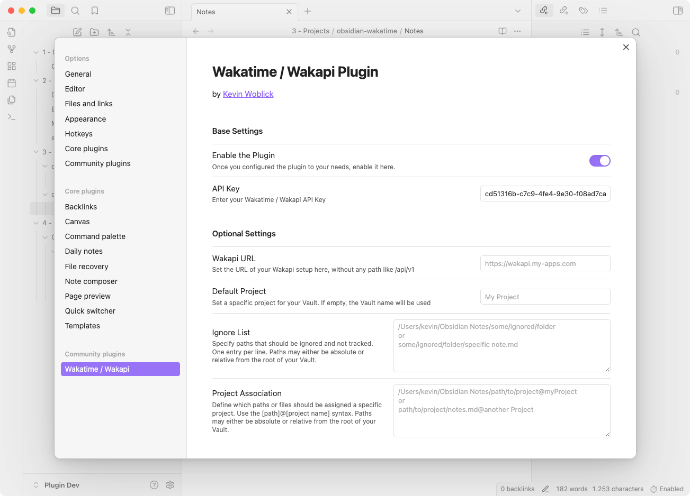

<h1 align="center">Wakatime / Wakapi Plugin for Obsidian</h1>

  <picture>
    <source media="(prefers-color-scheme: dark)" srcset="preview_dark.png">
    
  </picture>

This [Obsidian](https://obsidian.md) plugin allows you to track your time spent working on notes in Obsidian using [WakaTime](https://wakatime.com/) or [Wakapi](https://wakapi.dev/). This plugin sends heartbeats to the Wakatime API, recording your activity and providing insights into your productivity.

I built this plugin, as the official WakaTime plugin misses some features and makes it easier to set a custom URL within Obsidian, e.g. to your own Wakapi instance.

## Features

- Either connect with Wakatime or set a custom URL to your Wakapi instance.
- Set a default project or associate folders or files with different projects.
- Ignore specific files or folders from being tracked with a custom ignore list.
- Not only Markdown files, but also PDFs or images are tracked.
- Markdown is correctly set as a language for corresponding files.
- Lightweight installation without usage of the wakatime-cli client.

## Installation

### From Community Plugins (Coming soon...)
1. Open Obsidian.
2. Go to `Settings` > `Community plugins`.
3. Click on `Browse` and search for `Wakatime / Wakapi`.
4. Click `Install` and then `Enable`.

### From Release Download
1. Download the latest release from the [GitHub releases page](https://github.com/kovah/obsidian-wakatime/releases).
2. Extract the downloaded zip file.
3. Copy the extracted folder to your Obsidian plugins directory: `/.obsidian/plugins/`.
4. Open Obsidian and go to `Settings` > `Community plugins`. Click the reload icon.
5. Find `Wakatime / Wakapi` and click `Enable`.

## Configuration
1. Open Obsidian.
2. Go to `Settings` > `Wakatime / Wakapi`.

### Base Settings
- **Enable the Plugin**: Toggle to enable or disable the plugin.
- **API Key**: Enter your Wakatime or Wakapi API key. 

### Optional Settings
- **Wakapi URL**: Set the URL of your Wakapi setup.
- **Default Project**: Set a specific project for your Vault. If empty, the Vault name will be used.
- **Ignore List**: Specify paths that should be ignored and not tracked. One entry per line.
- **Project Association**: Define which paths or files should be assigned a specific project using the `[path]@[project name]` syntax.

---

This project is inspired and in small parts based on the [official Wakatime plugin](https://github.com/wakatime/obsidian-wakatime) and user contributions.

---

❤️ Support my work via [Patreon](https://www.patreon.com/Kovah), [Github Sponsors](https://github.com/sponsors/Kovah) or [Liberapay](https://liberapay.com/kovah/).
